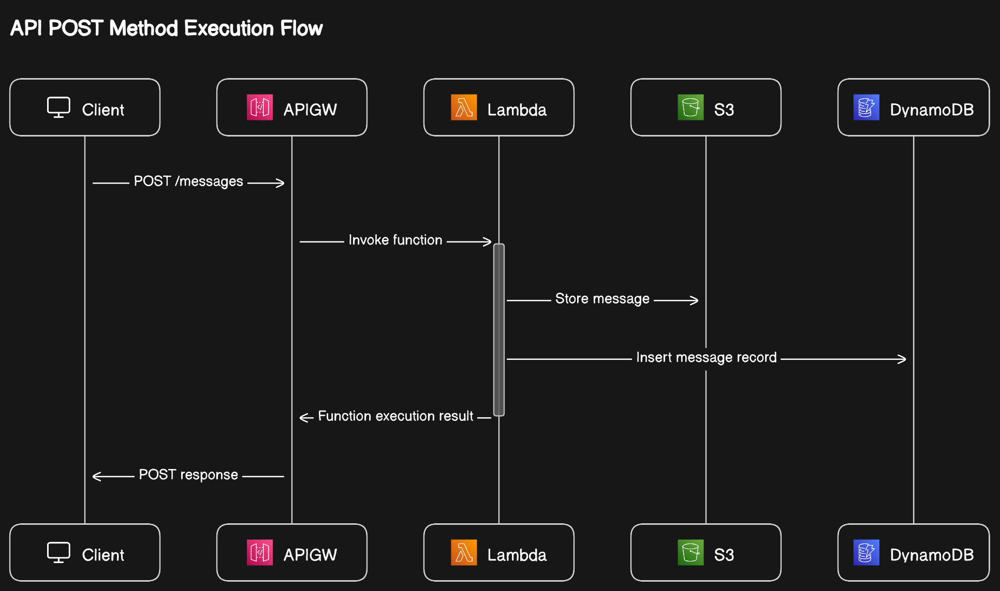

# Serverless Message Handler

- IAC tool is AWS CDK. Infra code can be found in lib directory. src directory contains lambda function code and utils.
- This CDK stack is account/region agnostic.

## Setup

- Configure your IAM credentials ( either as env varaibles / shared credentials file )
- Install packages - `npm install`
- Run `cdk bootsrap` if you haven't done previously in the curent AWS region. _( this command creates a bootstrap stack that will be required for CDK operations. )_
- Use `npm run deploy / yarn deploy`. It will output API GW root url to a file named outputs.json.
- **_Add that value to below postman collection's `backendURL` variable._**

[](https://app.getpostman.com/run-collection/31412429-c65349a5-5c87-4269-a85a-362a0a0ec273?action=collection%2Ffork&source=rip_markdown&collection-url=entityId%3D31412429-c65349a5-5c87-4269-a85a-362a0a0ec273%26entityType%3Dcollection%26workspaceId%3D392c3a34-1b4e-4f04-8e66-5ff0349ba141)

## Architecture Diagram

\*\* This diagram is created using eraser.io AI diagram creator


- User sents a message in below format.

```
{
"metadata":{
    "message_time":"2023-12-10T22:02:38Z",
    "company_id":"e0721e56-fb09-4273-ae74-7bcbc92d43eb",
    "message_id":"fc0daad3-4f10-4d15-b8c6-276cca111e87"
},
"data":{
    "order_id":"a929b88e-bc47-4f7d-9584-61c3c94ad2f2",
    "order_time":"2023-12-10T22:00:00Z",
    "order_amount":20
}
}
```

- This message gets validated in lambda function and stored as is in S3 and DynamoDB. ( validated based on message.metadata )
- DynamoDB table primary key is message_id. Message is stored as a JSON strigified object.
- message.json is stored in S3 under company name.
