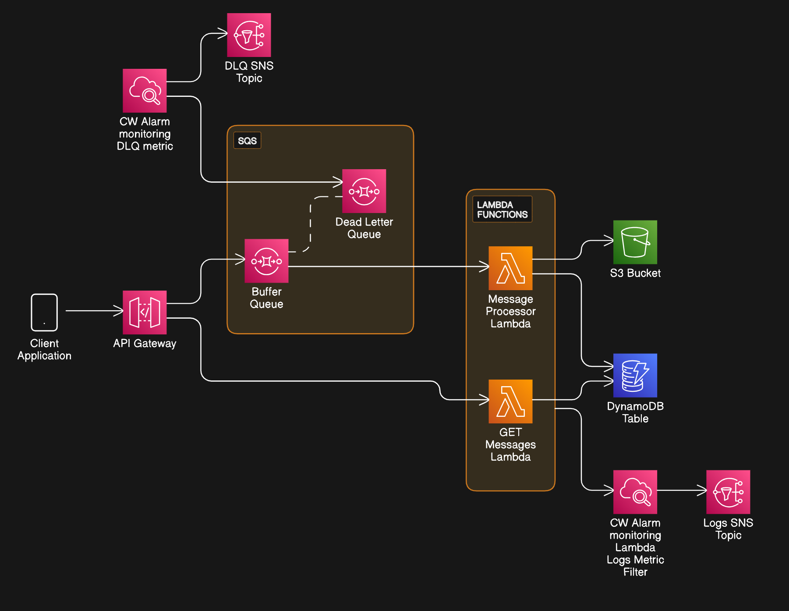

# Serverless Message Handler

- IAC tool is AWS CDK. Infra code can be found in lib directory. src directory contains lambda function code and utils.
- This CDK stack is account/region agnostic.

## Table of Contents
- [Setup](#setup)
- [Architecture Diagram](#architecture-diagram)
- [What Happens?](#what-happens)
  - [POST `/messages` route](#post-messages-route)
  - [GET `/messages` route](#get-messages-route)
- [Retrying](#retrying)
- [Idempotency](#idempotency)

## Setup

- Configure your IAM credentials ( either as env varaibles / shared credentials file )
- Install packages - `npm install`
- Run `cdk bootsrap` if you haven't done previously in the curent AWS region. _( this command creates a bootstrap stack that will be required for CDK operations. )_
- If you need access logs for API GW, should have a account wide IAM role ( per region ) to grant cloudwatch logs write permissions to all API Gws. And uncomment `deployOptions` prop in `serverless-test-stack.ts` file.
- Use `npm run deploy / yarn deploy`. It will output API GW root url to a file named outputs.json.
- **_Add that value to below postman collection's `backendURL` variable._**

[](https://app.getpostman.com/run-collection/31412429-c65349a5-5c87-4269-a85a-362a0a0ec273?action=collection%2Ffork&source=rip_markdown&collection-url=entityId%3D31412429-c65349a5-5c87-4269-a85a-362a0a0ec273%26entityType%3Dcollection%26workspaceId%3D392c3a34-1b4e-4f04-8e66-5ff0349ba141)

## Architecture Diagram



## What Happens?

### POST `/messages` route 

- User sents a message in below format.

```
{
"metadata":{
    "message_time":"2023-12-10T22:02:38Z",
    "company_id":"e0721e56-fb09-4273-ae74-7bcbc92d43eb",
    "message_id":"fc0daad3-4f10-4d15-b8c6-276cca111e87"
},
"data":{
    "order_id":"a929b88e-bc47-4f7d-9584-61c3c94ad2f2",
    "order_time":"2023-12-10T22:00:00Z",
    "order_amount":20
}
}
```

- This message gets validated in lambda function and stored as is in S3 and DynamoDB. ( validated based on message.metadata )

- message.json is stored in S3 under company name.

- DynamoDB table primary key is `message_id`. Message is stored as a JSON strigified object. `company_id` is used as a Global Secondary Index to support company based lookups.

- message status is saved as "Processed" from the same PutCommand used to write to message to DB. 

- Lambda service polls the SQS Buffer queue containing API requests. Batch Size is 1 for simplicity sake. 

- If an error was thrown it will be first caught by the catch block inside Lambda code. If error is a known non-transient error ( ex:- validation error ), error message is written to DB. Otherwise error will be rethrown from the catch block. 

- Lambda service will then identify this request as failed, and will push to SQS Queue for maximum of 2 times. Then it will be moved to DLQ.

- A cloudwatch Alarm is configured to trigger, based on a certain DLQ metric. Alarm will publish to a SNS topic, which can be used to notify interested parties.

- Lambda automatically writes to cw logs. Another alarm will go off, based on Lambda logs metric filter.
 
### GET `/messages` route

- 

## Retrying

- All thrown errors in POST lambda will be first caught by the catch block inside Lambda code. If error is a known non-transient error ( ex:- validation error ), error message is written to DB. Otherwise error will be rethrown from the catch block.
- Lambda service will then identify this request as failed, and will push to SQS Queue for maximum of 2 times. Then it will be moved to DLQ.
- AWS SDK has exponential retry mechanism built in. So retrying for failed SDK operations will be handled. 
- Summary - For retries, SDK built in retries + SQS and Lambda managed retry mechanisms

## Idempotency

- DDB put and S3 put are inherently idempotent. Which means retries does not have harmful side effects in current architecture. 
- For example if s3 PutObject succesful and ddb put fails, retrying the same request pose no harm.